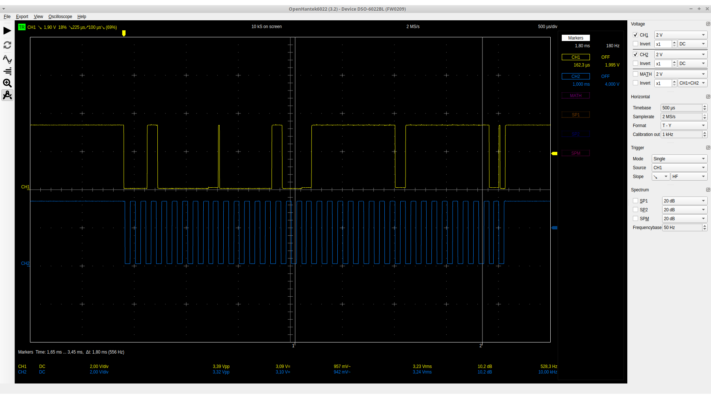
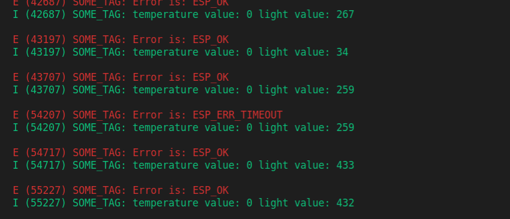
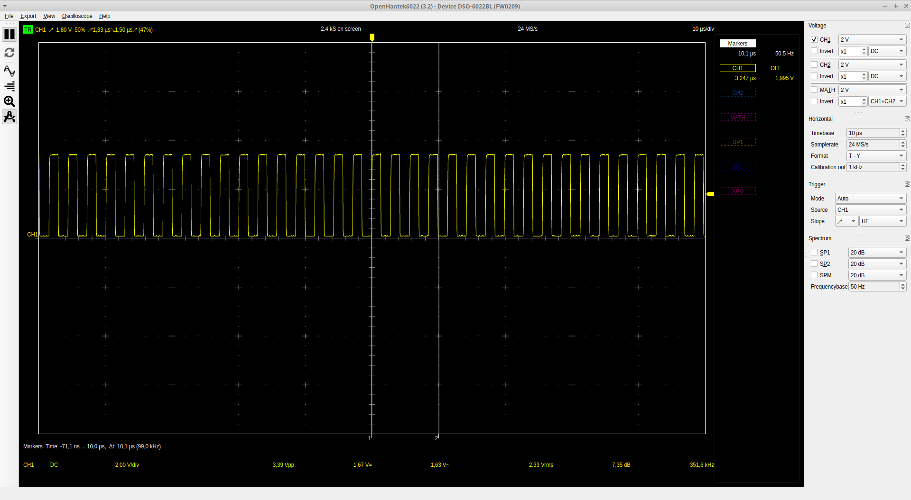
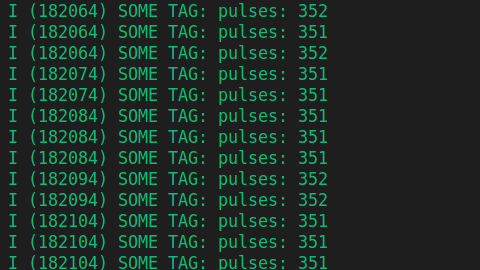

# AIS Project development diary

## 18/03/21:

### Initial state:
The projects initial state is inherited from "temalab" project, where from we have the board with the following properties:

- connectivity with stk3700 uController dev board (EFM32GG)
- I2C bus
  - Light sensor (VEML7700)
  - temperature sensor (LM-75)
- pump drive circuit
- device for capacity measurement (555 timer)
- 12VDC input
- screw terminals
  - capacity probe
  - pump

the board is manufactured, and measured, results:

- all I2C peripherals working
- timer working with strange duty cycle
- pump drive untested as of yet

### Goal:

The final goal is to make a system which can be set up in a domestic environment. The system consists of two main parts:
- node modules, which are to communicate with the core unit, receiving instructions, and watering plants. The applied controller is an ESP32.

- Core module, which is most likely a raspberry pi taking care of any type of user input, and controlling the nodes.

### Progression:

Several projects have been created using simplicity studio. The main goal is to test all devices using this prototype board, and the stk3700 and test all functionalities.

The last couple days I was struggling with PCNT configuration and timer configuration.
I2C configuration was done through the simplicity studios built in configurator. With some help, I was able to get I2C working.

Pulse counter is however unresponsive in the main project. I decided to launch a sample project where everything is configured properly. The results was good, the peripheral was working as intended.

I have built an external square signal generator from an ESP32 for testing purposes, using arduino framework, with platformIO. (This framework is easy to use, and platformIO is an easy to use, comfortable tool) This small 'module' is generating a low frequency square signal, and makes it easier to setup a new peripheral.

I started to change the code in the sample project, and comment out anything that is not strictly required for my application. This way the project is still functioning, compilation was successful.  In debug mode i tracked the counter value in a variable, the peripheral was working.

This makes me think that something was not properly configured with the original project.

Simplicity Studio 5s new project structure is much more chaotic for this type of small projects. I was thinking about creating a raw project where all unnecessary stuff is removed. Basic configuration, and learning could be much efficient that way.

## 19/03/21

### Hardware bugfixes:

An issue has been found in the 555 timer-based capacity sensor. The RA and RB resistors were soldered in a wrong order, which caused extremely high duty-cycle while measured. After the exchange, the board is fully functional, perfect 50% duty-cycle was measured with oscilloscope, frequency was shifted when the capacity connected to the board changed. There is no hardware malfunction discovered yet, the external power-, and drive systems are to be tested.

### Change in prototype:

No explanations were found concerning the Pulse Counter malfunction, in order to speed up the development process, this bug is no longer on todo list. I have a working example with stk3700, and planned to develop one with ESP.

### New Controler:

Experiments started with ESP32 development. Used development tools:
- espressif framework
- vs code
- platformIO plugin

Arduino framework was planned to be used, but with arduino, there seem to be no way to use the PCNT module of the chip.
Further research needs to be done about the characteristics of this module (especially frequency).

The ESP32 uses freeRTOS system, which is preinstalled. This might come handy when I develop networking while reading different sensor values. Although learning freeRTOS system is now a prioritized task.

### New platform:

Espressif controllers can be developed with Arduino IDE, there own IDE, or platformIO. The choice for this project is platformIO, because of the comfortable code completion, function tracking and compatibility with both frameworks (Arduino / Espressif-SDK).

Minor problems occurred during the first compile, after getting used to the environment problems were solved.
A basic project was created, testing GPIO-s with a 'blink' functionality.


## 03/04/21

For easier development I have installed a pure ESP-IDF. Removed platformIO, I try to work with only the framework, and compile my code via terminal. Installation was tough, fish script doesnt seem to work, I needed to use bash. This should be taken care of in the near future to remove a large handicap.
The problem lies with environment variables, I'll write down the solution, as soon as I find them.

### Tutorials were followed:
https://www.youtube.com/watch?v=5IuZ-E8Tmhg
https://docs.espressif.com/projects/esp-idf/en/latest/esp32/get-started/index.html *note that the fish scripts are failed to work*

### First test:
First test project, a simple blink example was successfully uploaded to the chip. I used VS Code, but mostly integrated terminal. Further research needed, how to embed a terminal like bash or fish, into VS Code, and how to get fish working.

For now, I can create projects manually, and compile them from CLI using ESP-IDFs `idf.py build`, and `idf.py flash -p /dev/ttyUSB0` commands. Debugging is not available for the time being.

Tasks are given:

-find fish-s problem in the scripts
-integrate fish, or bash into VS Code
-create a project, and test GPIO, I2C, and PCNT modules.

## 04/04/21

New morning, new thoughts. I seem to have found a solution for the problem. It seems the init script of fish does not work as intended. I set bash as the embedded terminal for VS Code, and created an alias in `.bash_aliases`, for initializing the shell for code compiling.

The alias:
```bash
alias idfinit=". $HOME/<idf-directory>/export.sh"
```

The `export.sh` code was copied from installation manual, and does all the setup work (initializing environment variables for example). The main problem is that bash can not execute any init command, and fish is still not working with the given scripts. By the way, fish has an argument, `-C` which does exactly what we need here.
If I find a way to solve this issue, I change my shell in VS Code.

### New project initialization:
1. Create a directory
2. Save as workspace, then setup the workspace terminal with the following JSON:

``` JSON
{
"folders": [
  {
    "path": "."
  }
],
  "settings": {

    "terminal.integrated.shell.linux": "/usr/bin/bash",
    "terminal.integrated.shellArgs.linux": [
    ]
  }
}
```
(The JSON is the created workspace file : `<project-name>.code-workspace`).

These settings are to set bash as default shell. (this move might be temporary due to bash / fish support difference mentioned above)
3. After saving workspace, allow it to modify embedded shell
4. Open the terminal, and write `idfinit` to initialize shell for development
5. Setup project, using `idf.py create-project`
  - `--help` is useful argument to find out how to do that
  - `idf.py create-project <project-name> -p . ` will create a new project directory in current folder, and initialize project. The output should be:

  ```
  Executing action: create-project
  The project was created in <project-directory>

  ```
  - this instruction creates a `CMakeLists.txt`, a `main` directory, `CMakeLists.txt` inside this directory, and `<project-name>.c` file, in my case `esp_gpio_test.c`.

6. For the following steps to work, build the yet empty project with `idf.py build` command in the terminal, this creates `.vscode` and `c_cpp_properties.json`.
7. To make includes work, we have to set the includePath setting
  - there should be a driectory called `.vscode` next to the project directory, and there is a file called `c_cpp_properties.json` in it.
  - in this file we can append the `includePath` section if needed
  - `/home/<username>/dev/esp-idf/**` line adds the IDF directory
  - now includes should work (and ctr + LMB helps to track)
8. To build, the working directory should be the one containing, the main source file
9. Build is done via `idf.py build` command
10. Flash is done via `idf.py -p /dev/ttyUSB0 flash` commands

### First handmade project

Using the method described above, I have created a simple task, which initialized a simple GPIO port, and sets it to high level.

No errors occurred.

## 05/04/21

### Problems with VS Code includes.
I have encountered a minor error in VS Code. A specific file, called sys/reent.h cannot be opened. Compiler doesn't seems to care much about it, only the editor.

Found a solution:

I inserted the following two lines into c_cpp_properties.json:
``` JSON

"compilerPath": "${config:idf.toolsPath}/tools/xtensa-esp32-elf/esp-2020r3-8.4.0/xtensa-esp32-elf/bin/xtensa-esp32-elf-gcc",
"compileCommands": "${workspaceFolder}/<your-project-directory>/build/compile_commands.json",

```

Now no errors shown. I have no clue what these lines done. Probably fixed some path issues.

source:
https://www.esp32.com/viewtopic.php?f=13&t=16585

### Serial communication

Found an easy way with `ESP_LOGI()`. This is a define of some sort, but available to send minimal data through serial port, which can be monitored with `idf.py monitor`.
This might be useful when debugging low level peripherals.

Watchdog has been turned off, for development purposes. It can be done by executing `idf.py menuconfig` command, then select Component config -> ESP System Settings, in which the `Interrupt watchdog` and `Initialize Task Watchdog Timer on startup` options can be disabled.

### I2C project:

I have initialized a new project to test I2C behavior in ESP32. For the time being, I will concentrate on the master side of the communication. The main sequence of the I2C usage is this:

  - create initialization struct (`i2c_config_t`)
  - set mode, SDA-SCL signal pins, and pullups
  - in case of a master device, we can set the clk speed as well
  - we need to call two functions:
    - `i2c_param_config()` where you select the device (called i2c port)
    - `i2c_driver_install()` where you install the driver for the specific device (I am not sure what this does)
  - we set the sequence up by the following:
    - i2c_cmd_handle_t cmd = i2c_cmd_link_create();
      - here we create a handler for the communication
      - this is a `void*` typedef inside, I presume the whole sequence
    - i2c_master_start();
      - adds the start bit at the beginning
    - i2c_master_write_byte();
      - writes an entire byte to the sequence, you can use this to address a device on the bus.
      - in the arguments list we can decide if we want to have an ACK signal at the end
    - i2c_master_read();
      - this one is self-explanatory, reads data from the bus
      - in the arguments we can tell the length of the data, as well as provide a variable to store it
    - i2c_master_stop();
      - puts a stop bit at the end
    - i2c_master_cmd_begin();
      - starts the sequence by sending all queued commands.
      - this function starts the communication, and as long as a command presents, it will continue sending it.
      - we can stop the sequence by calling th next function:
    - i2c_cmd_link_delete();
      - empties queue and stops transmitting

I2C Bus and the device seems working. Some problems occurred at the addressing, the correct way is `(<base address in 8 bit> | I2C_MASTER_READ)` as `i2c_master_read()`s argument.
The LM75 requires at least 300ms to reload measured data into data register, therefore we need at least 300 ms between requests. I have not found a better solution than pack the whole method into one function, and call it in a whiletrue with delays.

At least one peripheral is working with ESP already.


## 07/04/21

I tried to get the I2C working today on the VEML7700 but no success yet. I measured both I2C buses, and got these results, when tried to analyze the signal:



`0 0 0 1 0 0 0 0 0 0 0 0 0 0 0 1 0 0 0 1 1 1 1 1 1 1 1 0 1 1 1 1 1 1 1 1 0 0 1`

And I decoded it like this:

| start | address | R/W | ACK | command code  | ACK | data 1    | ACK | data 2    | ACK | stop |
| --- | --- |  --- | --- |  --- | --- |  --- | --- |  --- | --- | --- |
| 0     | 001 0000 | 0   | 0   | 0000 0100      | 0   | 1111 1111  | 0   | 1111 1111  | 0   | 1   |

Problem was a missing restart signal. This is still not solved.

Init sequence also got measured:


| start | address | R/W | ACK | Command code | ACK | data 1    | ACK | data 2    | ACK | stop |
| --- | --- |  --- | --- |  --- | --- |  --- | --- |  --- | --- | --- |
| 0     | 001 0000 | 0   | 0   | 0000 0100      | 0   | 0000 0000  | 0   | 0000 0000  | 0   | 1   |

And it seems correct. I am suspicious about the repeated start signal.

Small progress has been made. With the following function, I was able to read the measured light data correctly, at least most of the time.

``` C

void readVEML (uint8_t* data, uint8_t size){

    i2c_cmd_handle_t cmd = i2c_cmd_link_create();

    i2c_master_start(cmd);
    i2c_master_write_byte(cmd, (VEML_ADDR | I2C_MASTER_WRITE), true);
    i2c_master_write_byte(cmd, VEML_COMMAND, true);

    i2c_master_start(cmd);
    i2c_master_write_byte(cmd, (VEML_ADDR | I2C_MASTER_READ), true);
    i2c_master_read(cmd, data, size, I2C_MASTER_ACK);

    i2c_master_stop(cmd);

    i2c_master_cmd_begin(I2C_NUM_0, cmd, 1000 / portTICK_PERIOD_MS);
    i2c_cmd_link_delete(cmd);

    return;
}

```
Sometimes, it just breaks down, no matter what. I also experience huge desynchronisation in the program. I have configured a LED to blink every time when the main loop is executed, and it's a mess.

It seems that the issue was the incorrect define as the last argument of `i2x_master_read`, now it works most of the time.

I have increased the maximum wait ticks from `1000 / portTICK_PERIOD_MS` to `10000 / portTICK_PERIOD_MS`, now the delays seem much larger. It's worth checking out.

Found a way to debug:

``` C
ESP_LOGE(TAG,"Error is: %s", esp_err_to_name(error));
```



It seems, somehow I managed to create a timeout error. At TIMEOUT the variable doesn't change.

Finally I have made a working read function with the following code:

``` C

void readVEML (uint8_t* data, uint8_t size){

    i2c_cmd_handle_t cmd = i2c_cmd_link_create();

    i2c_master_start(cmd);
    i2c_master_write_byte(cmd, (VEML_ADDR | I2C_MASTER_WRITE), true);
    i2c_master_write_byte(cmd, VEML_COMMAND, true);

    i2c_master_start(cmd);
    i2c_master_write_byte(cmd, (VEML_ADDR | I2C_MASTER_READ), true);
    i2c_master_read(cmd, data, 1, I2C_MASTER_ACK);
    i2c_master_read_byte(cmd, data+1, I2C_MASTER_NACK);

    i2c_master_stop(cmd);

    esp_err_t error2 = i2c_master_cmd_begin(I2C_NUM_0, cmd, 1000 / portTICK_RATE_MS);
    i2c_cmd_link_delete(cmd);

    //ESP_LOGE(TAG,"Error Command %s", esp_err_to_name(error1));
    ESP_LOGE(TAG,"Error : %s", esp_err_to_name(error2));

    return;
}

```

It's working 97% of the time. Random ESP_TIMEOUT, and ESP_FAIL errors still happen, but rarely.

## 08/04/21

Today I looked into the PCNT modules setup function, and struct. It worked at first try!  A surprise to be sure, but a welcome one. The init phase goes like any other, we have an init struct, set our parameters then call an init function, (or config function to be precise).

PCNT init struct contains the following data:

``` C
pcnt_config_t pcntInitStruct = {
        .pulse_gpio_num = GPIO_NUM_22,
        .ctrl_gpio_num = GPIO_NUM_23,
        .lctrl_mode = PCNT_MODE_KEEP,
        .hctrl_mode = PCNT_MODE_KEEP,
        .pos_mode = PCNT_COUNT_INC,
        .neg_mode = PCNT_COUNT_DIS,
        .counter_h_lim = PCNT_LIMIT_MAX,
        .counter_l_lim = 0,
        .unit = PCNT_UNIT_0,
        .channel = PCNT_CHANNEL_0
    };
```
I initialized everything that is defined in the struct with these parameters. Most of them are defines in the `pcnt_types.h` except `PCNT_LIMIT_MAX` which i have defined as 65535 (0xFFFF).

the PCNT module can be controlled easily with the following functions:
- `pcnt_get_counter_value`
- `pcnt_counter_pause`
- `pcnt_counter_resume`
- `pcnt_counter_clear`

They do exactly what their name tells.
Using an unsigned variable might be useful in the future, because there is no point in negative values in our case.

Measurements represent the expected values:



My signal has 351 kHz frequency which means, it should be around 351-2 pulses in one millisecond.



And the given output is exactly matching our expectations. Yaay!

## 18/04/21

Today I fixed some issues with the dev-diary, and started to learn freeRTOS. A simple task will run on the ESP32 which is to read all three sensors values. For this reason I have created a new project called `AIS_node_v1`, and collected all I2C, PCNT and GPIO codes that I have written.

First test was a complete success, all values a read correctly. Errors might be happening, so our next objective is to detect errors, and filter them out.

## 20/04/21

Today I wrote a simple task to execute the measurement cycle. I have some concepts about the main architecture of the nodes task system.

The ESP32 uses a modified freeRTOS to run user tasks parallel to WiFi management. My concept for now is the following:

- Tasks:
  - main  -> schedules the measurement task, at 10 seconds or when comm task tells it
  - measure  -> executes a measurement cycle
  - comm  -> receives input from serial port and/or WiFi


``` C

static void measureTask (void* vParam){

    uint8_t lm_data[2] = {0,0};
    uint8_t veml_data[2] = {13,15};

    while (1)
    {

        pcnt_counter_clear(PCNT_UNIT_0);
        vTaskDelay(100/portTICK_PERIOD_MS);   
        pcnt_get_counter_value(PCNT_UNIT_0, (int16_t*)&cnt);


        readLM(lm_data, 2);
        temperature = lm_data[0];

        readVEML(veml_data, 2);
        light = (256*veml_data[1]+veml_data[0]);


        // temporary:
        ESP_LOGI(TAG, "measured values %d, %d, %d", temperature, light, cnt);

    }  
}
```
This is the measurement task. `vTaskDelay()` and `vTaskDelayUntil()` functions seems to be equivalent in use in this case.

Default timing will be done with suspended state. Measurement task has been appended with a self suspending function, (`vTaskSuspend(NULL)`) and the main task will, resume the task with `vTaskResume(<tskHandle>)`.

Added mutexes for data variables, and a measurement control boolean variable. A new task has been created, named main. for the 10 second timing, I use a software timer.

For reasons I have not yet found, I am getting continuous chip resets. The problem might be with the mutexes, according to the debug logs.


## 21/04/21

Quick log for today, because I am tired. The improvements and modifications that I made:

  - All `ESP_LOGI` / `ESP_LOGE` macros are deleted, from now on we only use `printf()` which happened to be working for some reason.
  - mutexes are deleted as long as the main project has serious problems with task management
  - watchdogs will remain a problem so they are still turned off in the project
  - `xTaskCreate()` functions are expecting to get handler pointer which caused a metric ton of problems, this is now fixed.
  - unused PCNT counter event values are set to zero, because they were producing errors every startup (doesn't seems to affect the whole progression tho)
  - started an uart project to learn uart configuration, but no need to it, so the project is abandoned for the time being
  - tweaked delay time to 1 sec, for debug purposes
  - increased stack sizes to `2048`, from original `configMINIMAL_STACK_SIZE`
  - `app_main()` task is suspended, after creating the three tasks (`main`, `measure`, `timer`)

## 22/04/21

Today I reworked the task structure. Task `measureTask` task is no longer suspends itself after every iteration, instead it delays itself for a small amount of time. Task `mainTask` is responsible for reading the measured data and calculate an average from every 10 measured value. For easier data management I have created a struct:

``` C
typedef struct {
    uint16_t cnt;
    uint16_t light;
    uint8_t temperature;
}data_pack;

```

This struct contains all measured data that we have to manage.

Inter-task communication is done with a queue (default freeRTOS API). The Queue is 10 long, but it is an overkill, because main can drain all data faster than measure can load.

Mutexes are removed because there is no global variable needs to be accessed simultaneously.

I also created a function to calculate averages (`xAverage`) but it doesn't give accurate results.

## 23/04/21

The average counter function was providing false data because printf() received wrong arguments firs time, and some overflow error happened as well. After that fixed and some small simplification in the average counting function, we are getting correct results.

`mainTask` is renamed to be `processTask` from now on, it represents the tasks purpose better.

Measurements control is restored to the software timer, therefore more precise cycles can be achieved:
  - `measureTask` is now suspends itself (again)
  - timer is resuming it from a callback function

I have looked through the code, and deleted unnecessary segments like mutex declarations, unused global variables etc.

Defines have been created for further readability, and queue length has been decreased to 3, because 10 length queue was an overkill, and 3 is just enough.
To be fair one is enough, because with default configuration, the queue doesn't hold more than one item at any time. 3 is only for security.
